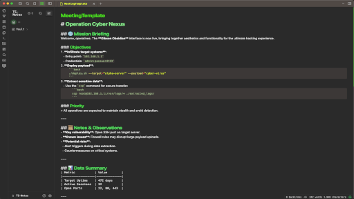
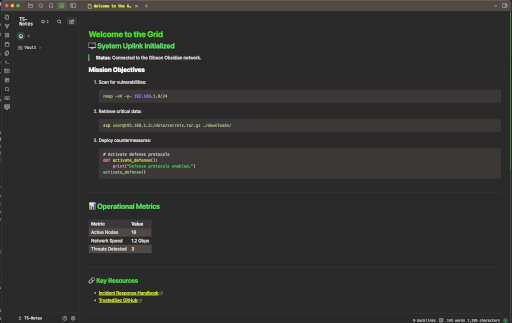

# Gibson Obsidian

**Gibson Obsidian** is a retro-inspired hacker theme designed for Obsidian. It merges cyberpunk aesthetics with TrustedSec-inspired colors for a sleek, immersive dark mode experience. This theme is perfect for anyone who loves the feel of vintage terminals paired with modern functionality.

## 🖤 Features
- **Signature Colors**: Gibson Green (`#14E21A`), Phantom Blue (`#1C47FF`), and Cereal Yellow (`#E8FD2E`).
- **Retro Aesthetics**: Inspired by green-on-black terminals with glowing hover effects.
- **Dynamic Animations**: Hover effects, terminal-style blinking cursors, and smooth transitions.
- **Markdown & Code Highlights**: Enhanced syntax highlighting for clarity and style.

## ✨ Installation
### Automatic Installation
1. Go to **Settings > Appearance** in Obsidian.
2. Scroll down to the **Community Themes** section.
3. Search for "Gibson Obsidian" and click "Use" to apply the theme.

### Manual Installation
1. Download or clone this repository:
   ```bash
   git clone https://github.com/your-repo/gibson-obsidian.git
   ```
2. Add the whole `Gibson Obsidian` folder to your `.obsidian/themes/` folder.
   - On most systems, the folder path is: `~/.obsidian/themes/`
3. In Obsidian, go to **Settings > Appearance** and select **Gibson Obsidian** from the list of installed themes.

## 🌐 Inspiration
Named after William Gibson, the father of cyberpunk, **Gibson Obsidian** blends nostalgia with innovation. TrustedSec’s signature colors provide a touch of professionalism while honoring the aesthetics of early hacker culture.

## 📜 License
This theme is open source and available under the [MIT License](LICENSE). Feel free to tweak and share it!

## 📸 Screenshots



---

> "The future is already here – it's just not evenly distributed." – William Gibson

